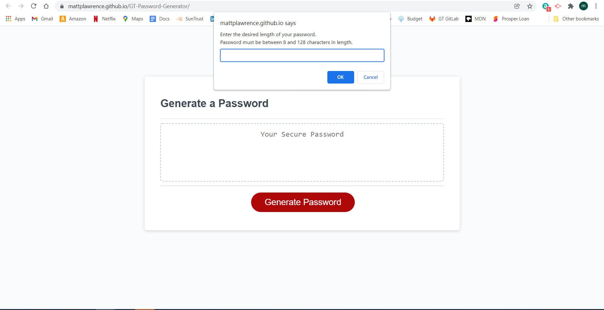

# GT-Password-Generator
GT Homework number 3, JS password generator

## Host Location:
https://mattplawrence.github.io/GT-Password-Generator/

## Purpose:
The purpose of this project was to create a password generator that takes user input and outputs a password according to user selections.

## Problem:
The problem is to find a way to generate a random password containing only the types of characters the user wants. Additionally the password must be the length the user requests, between 8 and 128.

### The problems encountered include:
* Creating prompt windows with the correct questions.
* Handling incorrect input to the number of characters. This includes zero length strings and numbers outside the range of 8-128.
* Creating a bank of characters that represent the choices of the user.
* Picking random characters for the password.
* Displaying the final password in the text area of the DOM.

## What I learned:
I learned how to use a for loop to assign random values from a string to create a new string. Additionally I learned how to take a variable in JavaScript and display it on the webpage as if it were in the HTML.

## Preview:
The website landing page as written in this repository should look like the following image:

